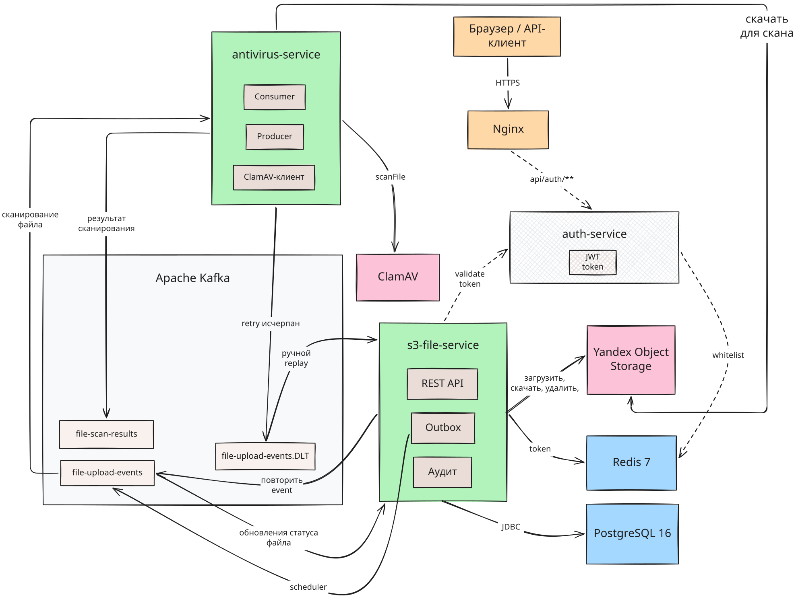

# CloudFileHub
> 🚀 **Live demo:** https://cloudfilehub.duckdns.org/swagger-ui/index.html

Файловый хостинг на S3 с JWT-аутентификацией, ролевой моделью и асинхронным антивирусным сканированием.

## Архитектура

* **Слои** - в `s3-file-service` цепочка `Controller -> Facade -> Service -> Repository`: контроллеры без бизнес-логики, фасад координирует сервисы и собирает ответ.
* **Асинхронное сканирование** - загрузка не ждёт антивирус: событие уходит в Kafka, `antivirus-service` забирает файл из S3, прогоняет через ClamAV и возвращает вердикт отдельным топиком.
* **Transactional Outbox** - события пишутся в БД, доставляются в Kafka планировщиком с retry и exponential backoff, поэтому недоступность брокера не теряет событий.
* **Стратегии вместо ветвлений** - обработка ошибок пакетной загрузки вынесена в `ErrorResponseStrategy`, новый тип ошибки добавляется новой реализацией без правки существующего кода.
* **Валидация аннотациями** - правила вынесены в собственные ограничения (`@ValidFile`, `@ValidBatchSize`) вместо цепочек проверок в сервисах.
* **Мгновенный отзыв токенов** - JWT в HttpOnly cookie плюс whitelist в Redis: выход и блокировка пользователя действуют сразу, не дожидаясь истечения срока.
* **Аудит через AOP** - бизнес-код не знает о журналировании, записи пишутся асинхронно с прокидыванием MDC в фоновый поток.



## Возможности

| Возможность | Аноним | USER | ADMIN |
|-------------|:------:|:----:|:-----:|
| Просмотр списка и скачивание | + | + | + |
| Загрузка файлов | | 1 файл | пакетно |
| Удаление файлов | | свои | любые |
| Управление пользователями | | | + |
| Аудит-логи и статистика | | | + |
| Повторное сканирование и DLT | | | + |

Ограничения: файл до 30MB, тип проверяется по сигнатуре содержимого, rate limiting на Nginx (`auth` 5r/min, `upload` 2r/s, `api` 10r/s).

**Доступ:**
- API: https://cloudfilehub.duckdns.org/api/home
- Swagger UI: https://cloudfilehub.duckdns.org/swagger-ui/index.html
- Kafka UI: https://cloudfilehub.duckdns.org/kafka-ui/

## API

| Метод | Путь | Описание |
|-------|------|---------|
| `POST` | `/api/auth/register` | регистрация, роль USER |
| `POST` | `/api/auth/login` | вход, JWT в HttpOnly cookie |
| `POST` | `/api/auth/logout` | выход с отзывом токена из whitelist |
| `GET` | `/api/home` | публичный список проверенных файлов |
| `GET` | `/api/files/{uniqueName}` | скачивание файла без аутентификации |
| `POST` | `/api/files/upload` | загрузка файла |
| `POST` | `/api/files/multiple-upload` | пакетная загрузка, только ADMIN |
| `DELETE` | `/api/files/{uniqueName}` | удаление своего файла, ADMIN удаляет любой |
| `*` | `/api/admin/**` | пользователи, аудит-логи, статистика файлов, повторное сканирование и DLT |

Полная спецификация: [docs/openapi.yaml](docs/openapi.yaml). Это снимок, deploy-версия доступна в [Swagger UI](https://cloudfilehub.duckdns.org/swagger-ui/index.html).

## Тестирование

Сервисный слой основного модуля `s3-file-service` покрыт unit и интеграционными тестами. JaCoCo собирает объединённый отчёт покрытия.

* **Unit-тесты** — Mockito, запускаются через Maven Surefire
* **Интеграционные тесты** — Testcontainers (PostgreSQL, Redis, Kafka, S3Mock), запускаются через Maven Failsafe
```bash
# Требования: JDK 21, Docker
./mvnw verify -pl s3-file-service
```


Отчёт генерируется в `target/site/jacoco-merged/`.

## Быстрый старт
```bash
git clone https://github.com/Vldr22/cloud-file-hub.git
cd cloud-file-hub
cp .env.example .env                # заполнить переменные окружения
./scripts/docker-build-and-logs.sh  # 1) Собрать, 2) Поднять
```

## Roadmap

- [x] Unit и integration тесты
- [x] Деплой на VPS
- [x] CI/CD (GitHub Actions)
- [x] Outbox pattern — гарантированная доставка событий в Kafka
- [ ] Вынести аутентификацию и авторизацию в отдельный сервис
- [ ] Фронтенд через AI
- [ ] Presigned URL для скачивания файлов напрямую из S3
- [ ] Email-уведомления о результатах сканирования
- [ ] Полнотекстовый поиск (Elasticsearch)

